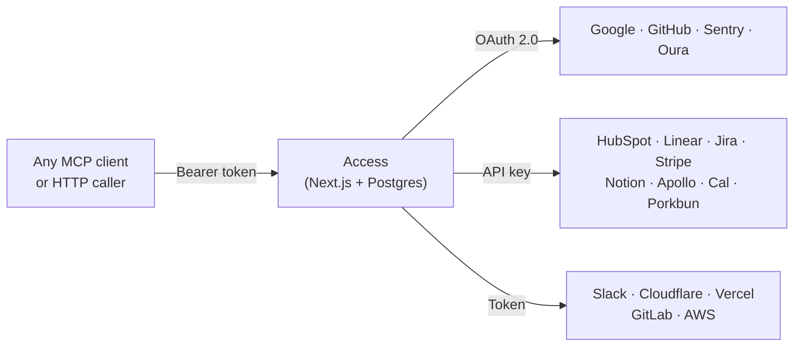

# Access

Self-hosted secret, context, and bootstrap service for agents and scripts.

One Bearer token, all your services. Your agents never touch OAuth tokens, API keys, or auth flows.

## What is this?

Access is an **MCP-native API gateway** that combines a credential store, API proxy, and MCP server into a single self-hosted Next.js app. Agents authenticate with a single Bearer token and hit proxy endpoints like `/api/v1/google/gmail?action=search&q=...` — Access handles OAuth, token refresh, and forwards the request upstream. The agent never sees or manages credentials directly.

Unlike platforms like Composio or Nango, Access is fully self-hosted, the agent does not participate in auth flows, and it works as an MCP server with Claude Code, Cursor, Gemini CLI, Codex, Windsurf, and any other MCP-compatible client out of the box.

## Why not just use `.env` files?

Env files break down quickly when you have multiple agents, multiple machines, and services that use OAuth:

- **OAuth tokens expire.** Google access tokens last 60 minutes. Your agent can't refresh them — but Access can.
- **Credentials scatter.** Each agent session needs its own copy. Rotate a key and you're updating it in 6 places.
- **No audit trail.** Which agent accessed which service? When? From where? You have no idea.
- **Bootstrapping is painful.** Every new session starts with loading env vars and hoping nothing expired.

Access solves all of these. Agents call one URL with one token. Access refreshes OAuth, proxies the API, logs the access, and returns the result.

## Quick Start

### Prerequisites

- Node.js 20+
- PostgreSQL (or use the included Docker Compose)
- A Google Cloud OAuth app (if you want Google API proxying)

### 1. Clone and install

```bash
git clone https://github.com/Scottpedia0/access.git
cd access
npm install
```

### 2. Set up the database

```bash
# Option A: Use Docker Compose
docker compose up -d

# Option B: Use your own Postgres
# Set DATABASE_URL and DIRECT_DATABASE_URL in .env
```

### 3. Configure environment

```bash
cp .env.example .env

# Generate required secrets
openssl rand -base64 32  # -> SECRET_ENCRYPTION_KEY
openssl rand -base64 32  # -> NEXTAUTH_SECRET
openssl rand -base64 32  # -> CONSUMER_TOKEN_HASH_SECRET
```

Edit `.env` with your values. At minimum you need:
- `DATABASE_URL` / `DIRECT_DATABASE_URL`
- `SECRET_ENCRYPTION_KEY`
- `NEXTAUTH_SECRET`
- `OWNER_EMAILS` (comma-separated list of emails allowed to log in)
- One auth provider (Google OAuth, email magic link, or owner password)

### 4. Run migrations and seed

```bash
npx prisma migrate deploy
npm run db:seed  # Creates example services and a consumer token
```

### 5. Start the app

```bash
npm run dev
```

Visit `http://localhost:3000` and sign in with an email from your `OWNER_EMAILS` list.

## Supported Services

### Service Proxy Adapters

Access ships with proxy adapters that handle auth and forward requests to upstream APIs:

| Service | Endpoint | Auth Type |
|---------|----------|-----------|
| **Gmail** | `/api/v1/google/gmail` | OAuth 2.0 |
| **Google Calendar** | `/api/v1/google/calendar` | OAuth 2.0 |
| **Google Drive** | `/api/v1/google/drive` | OAuth 2.0 |
| **Google Sheets** | `/api/v1/google/sheets` | OAuth 2.0 |
| **Google Docs** | `/api/v1/google/docs` | OAuth 2.0 |
| **Google Contacts** | `/api/v1/google/contacts` | OAuth 2.0 |
| **Google Analytics** | `/api/v1/google/analytics` | OAuth 2.0 |
| **Google Search Console** | `/api/v1/google/search-console` | OAuth 2.0 |
| **Google Tag Manager** | `/api/v1/google/tag-manager` | OAuth 2.0 |
| **Google Admin Reports** | `/api/v1/google/admin-reports` | OAuth 2.0 |
| **Google Account Profile** | `/api/v1/google/profile` | OAuth 2.0 |
| **HubSpot** | `/api/v1/hubspot` | Private app token |
| **Slack** | `/api/v1/slack` | Bot token |
| **Cloudflare** | `/api/v1/cloudflare` | API token |
| **Apollo.io** | `/api/v1/apollo` | API key |
| **Cal.com** | `/api/v1/cal` | API key |
| **Oura Ring** | `/api/v1/oura` | Personal access token |
| **Porkbun** | `/api/v1/porkbun` | API key + secret |
| **Vercel** | `/api/v1/vercel` | Personal token |
| **GitHub** | `/api/v1/github` | Personal access token |
| **Linear** | `/api/v1/linear` | API key |
| **Jira** | `/api/v1/jira` | Email + API token |
| **GitLab** | `/api/v1/gitlab` | Personal access token |
| **Notion** | `/api/v1/notion` | Internal integration token |
| **AWS** | `/api/v1/aws` | IAM access key + secret |
| **Sentry** | `/api/v1/sentry` | Auth token |
| **Stripe** | `/api/v1/stripe` | Secret key (read-only) |

Google services support **multiple accounts** — configure via the `GOOGLE_ACCOUNTS` env var (e.g., `work:me@company.com,personal:me@gmail.com`).

### Core Endpoints

These aren't service proxies — they're Access itself:

| Endpoint | What it does |
|----------|-------------|
| `GET /api/v1/bootstrap` | One pull that returns all secrets as env vars + service metadata + docs + linked resources. This is how agents bootstrap a session. |
| `POST /api/v1/intake` | Write-only endpoint for submitting new credentials without read access to the store. |
| `GET /api/v1/secrets/by-env/:name` | Look up a single decrypted secret by its env var name. |
| `GET /api/v1/services/:slug` | Service metadata, docs, and linked resources. |
| `GET /api/v1/services/:slug/secrets` | Decrypted secrets for a specific service. |

## Authentication

Access supports three token types for agent authentication:

| Token Type | Scope | Use case |
|-----------|-------|----------|
| **Global Agent Token** | Full access to all services and secrets | Trusted single-operator setups |
| **Consumer Tokens** | Granular per-service or per-secret access grants | Multi-agent setups where each agent gets different permissions |
| **Shared Intake Token** | Write-only credential submission | Let team members drop keys without read access |

```bash
# Search Gmail with a global token
curl -H "Authorization: Bearer YOUR_TOKEN" \
  "http://localhost:3000/api/v1/google/gmail?action=search&q=from:alice&account=work"

# Bootstrap an agent session — pull everything at once
curl -H "Authorization: Bearer YOUR_TOKEN" \
  "http://localhost:3000/api/v1/bootstrap"
```

Human authentication for the admin UI uses Google OAuth, email magic links, or a simple password — configured via env vars. Only emails in `OWNER_EMAILS` can log in.

## Adding a New Service

Each proxy adapter is a Next.js route handler under `src/app/api/v1/<service>/route.ts`. To add one:

1. Create `src/app/api/v1/your-service/route.ts`
2. Use `authenticateRequestActor()` from `@/lib/access` for auth
3. Read the API key from the encrypted store (via Prisma) or env vars
4. Proxy the request to the upstream API
5. Return the result

Most adapters are under 100 lines. See `src/app/api/v1/hubspot/route.ts` for a clean example.

## MCP Server

Access includes an MCP server (`mcp-server.mjs`) that exposes Google Workspace tools via stdio transport. Works with any MCP-compatible client.

Add the following config to your client. The JSON is the same — only the file path changes per client:

| Client | Config location |
|--------|----------------|
| **Claude Code** | `~/.claude/mcp.json` or project `.mcp.json` |
| **Cursor** | Cursor MCP settings |
| **Gemini CLI** | `.gemini/settings.json` |
| **Windsurf** | Windsurf MCP settings |
| **VS Code (Copilot)** | `.vscode/mcp.json` (use `"servers"` instead of `"mcpServers"`) |
| **Codex / other** | Any MCP-compatible config |

```json
{
  "mcpServers": {
    "access": {
      "command": "node",
      "args": ["/path/to/access/mcp-server.mjs"],
      "env": {
        "ACCESS_BASE_URL": "http://localhost:3000",
        "GLOBAL_AGENT_TOKEN": "your-token-here"
      }
    }
  }
}
```

> **VS Code note:** Use `"servers"` as the top-level key instead of `"mcpServers"`.

Once connected, your agent gets tools like `gmail_search`, `calendar_list`, `drive_list`, `contacts_search`, and more — all authenticated through Access.

### Direct API (No MCP)

You don't need MCP. Any HTTP client works:

```bash
curl -H "Authorization: Bearer $TOKEN" \
  "http://localhost:3000/api/v1/google/gmail?action=search&q=is:unread"
```

## Architecture



### How a request flows

```
1. Agent sends:     GET /api/v1/google/gmail?action=search&q=from:alice&account=work
                    Authorization: Bearer amb_live_xxxx

2. Middleware:       Rate limit check → Body size check → Pass

3. Auth:            Validate Bearer token (HMAC comparison)
                    Look up consumer permissions or verify global token

4. Proxy:           Load OAuth credentials from Postgres (encrypted)
                    Refresh access token if expired
                    Forward request to Gmail API

5. Response:        Return Gmail results as JSON to agent
                    Log access in audit_events table
```

### Design principles

- **Agents never see credentials.** They send a Bearer token, get back API results.
- **OAuth is handled server-side.** Token refresh, consent flows, multi-account management — all inside Access.
- **Everything is audited.** Every secret access, every API proxy call, every login attempt is logged with actor, timestamp, and IP.
- **Secrets are encrypted at rest.** AES-256-GCM with versioned payloads (`v1.iv.authTag.ciphertext`).
- **Consumer tokens use HMAC.** Constant-time comparison, only the prefix is stored — never the raw token.
- **Stateless proxy.** Access doesn't cache or store API responses. It's a pass-through.

## Security

- AES-256-GCM encryption for all stored secrets
- HMAC-SHA256 consumer token hashing with constant-time comparison
- Zod input validation on all API endpoints
- Audit logging for all access events and auth failures
- Owner email allowlist for admin UI access
- Error messages in production never leak upstream details
- Health endpoint requires auth to expose inventory counts
- Rate limiting on auth and API endpoints (configurable, in-memory by default)
- Request body size limits on all mutating endpoints

### Security Roadmap

- [ ] Per-service scoped tokens (split global token into granular permissions)
- [ ] Key rotation support
- [ ] Redis-backed rate limiting for serverless
- [ ] Envelope encryption / KMS integration

## Deployment

Access deploys well on **Vercel** with a **Neon** or **Supabase** Postgres database:

1. Push to GitHub
2. Import in Vercel
3. Set all env vars from `.env.example`
4. Set `NEXTAUTH_URL` to your production URL
5. Add `your-domain.com/api/google/callback` as an authorized redirect URI in Google Cloud Console
6. Run `npx prisma migrate deploy` via Vercel build command

Works anywhere Node.js runs — Vercel, Railway, Fly.io, a VPS, your laptop.

## Development

```bash
npm run dev          # Start dev server
npm run build        # Production build
npm run lint         # ESLint
npm run typecheck    # TypeScript check
npm run db:studio    # Prisma Studio (GUI for database)
npm run db:seed      # Seed example data
```

## License

MIT
