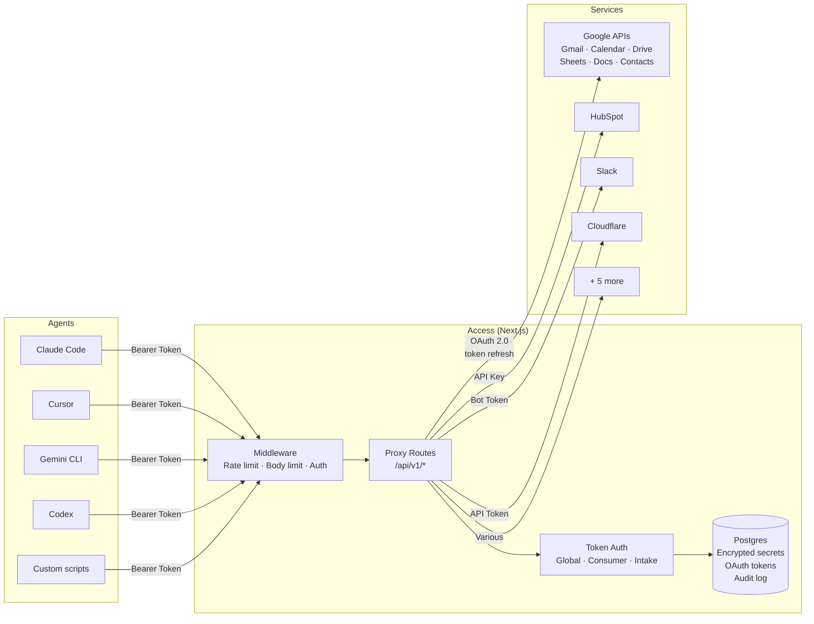

# Access

Self-hosted secret, context, and bootstrap service for agents and scripts.

One Bearer token, all your services. Your agents never touch OAuth tokens, API keys, or auth flows.

## What is this?

Access is an **MCP-native API gateway** that combines a credential vault, API proxy, and MCP server into a single self-hosted Next.js app. Agents authenticate with a single Bearer token and hit proxy endpoints like `/api/v1/google/gmail?action=search&q=...` -- the vault handles OAuth, token refresh, and forwards the request to the upstream API. The agent never sees or manages credentials directly.

Unlike platforms like Composio or Nango, Access is fully self-hosted, the agent does not participate in auth flows, and it works as a Claude Code MCP server out of the box.

## Why not just use .env files?

Env files break down quickly when you have multiple agents, multiple machines, and services that use OAuth:

- **OAuth tokens expire.** Someone has to refresh them. With env files, that someone is you -- manually, every hour.
- **Credentials scatter.** Each agent session needs its own copy. Rotate a key and you update 6 places.
- **No audit trail.** Which agent accessed which service? When? You have no idea.
- **Bootstrapping is painful.** Every new session starts with `source ~/.env-that-has-everything` and a prayer.

Access solves all of these. Agents call one URL with one token. The vault refreshes OAuth, proxies the API, logs the access, and returns the result.

## Quick Start

### Prerequisites

- Node.js 20+
- PostgreSQL (or use the included Docker Compose)
- A Google Cloud OAuth app (for Google API proxy features)

### 1. Clone and install

```bash
git clone https://github.com/Scottpedia0/access.git
cd access
npm install
```

### 2. Set up the database

```bash
# Option A: Use Docker Compose
docker compose up -d

# Option B: Use your own Postgres
# Set DATABASE_URL and DIRECT_DATABASE_URL in .env
```

### 3. Configure environment

```bash
cp .env.example .env

# Generate required secrets
openssl rand -base64 32  # -> SECRET_ENCRYPTION_KEY
openssl rand -base64 32  # -> NEXTAUTH_SECRET
openssl rand -base64 32  # -> CONSUMER_TOKEN_HASH_SECRET
```

Edit `.env` with your values. At minimum you need:
- `DATABASE_URL` / `DIRECT_DATABASE_URL`
- `SECRET_ENCRYPTION_KEY`
- `NEXTAUTH_SECRET`
- `OWNER_EMAILS` (comma-separated list of emails allowed to log in)
- One auth provider (Google OAuth, email magic link, or owner password)

### 4. Run migrations and seed

```bash
npx prisma migrate deploy
npm run db:seed  # Creates example services and a consumer token
```

### 5. Start the app

```bash
npm run dev
```

Visit `http://localhost:3000` and sign in with an email from your `OWNER_EMAILS` list.

## Supported Services

Access ships with proxy adapters for:

| Service | Endpoint | Auth Type |
|---------|----------|-----------|
| **Google Workspace** (Gmail, Calendar, Drive, Sheets, Docs, Contacts, Analytics, Search Console, Tag Manager, Admin Reports, YouTube) | `/api/v1/google/*` | OAuth 2.0 (multi-account) |
| **HubSpot** | `/api/v1/hubspot` | Private app token |
| **Slack** | `/api/v1/slack` | Bot token |
| **Cloudflare** | `/api/v1/cloudflare` | API token |
| **Apollo.io** | `/api/v1/apollo` | API key |
| **Cal.com** | `/api/v1/cal` | API key |
| **Oura Ring** | `/api/v1/oura` | Personal access token |
| **Porkbun** | `/api/v1/porkbun` | API key + secret |
| **Vercel** | `/api/v1/vercel` | Personal token |

The Google adapter supports **multiple accounts** simultaneously -- configure them via the `GOOGLE_ACCOUNTS` env var (e.g., `work:me@company.com,personal:me@gmail.com`).

## Authentication

Access supports three methods for agent authentication:

1. **Global Agent Token** -- A single Bearer token that grants access to all services. Best for trusted single-operator setups.
2. **Consumer Tokens** -- Per-agent tokens with granular access grants. Use when you want different agents to have different permissions.
3. **Shared Intake Token** -- A special token for a no-login key drop page where team members can submit credentials.

```bash
# Agent request with global token
curl -H "Authorization: Bearer YOUR_GLOBAL_TOKEN" \
  "http://localhost:3000/api/v1/google/gmail?action=search&q=from:someone@example.com&account=work"

# Bootstrap: pull all secrets at once
curl -H "Authorization: Bearer YOUR_GLOBAL_TOKEN" \
  "http://localhost:3000/api/v1/bootstrap"
```

## Adding a New Service

Each proxy endpoint is a Next.js route handler in `src/app/api/v1/<service>/route.ts`. To add a new service:

1. Create the route file at `src/app/api/v1/your-service/route.ts`
2. Use `authenticateRequestActor()` from `@/lib/access` for auth
3. Read the API key from the vault (via Prisma) or env vars
4. Proxy the request to the upstream API
5. Return the result

See any existing adapter (e.g., `src/app/api/v1/hubspot/route.ts`) as a template.

## MCP Server

Access includes a standalone MCP server (`mcp-server.mjs`) that exposes all Google Workspace tools via the stdio transport. Works with any MCP-compatible client.

### Claude Code

Add to `~/.claude/mcp.json` or your project's `.mcp.json`:

```json
{
  "mcpServers": {
    "access": {
      "command": "node",
      "args": ["/path/to/access/mcp-server.mjs"],
      "env": {
        "ACCESS_BASE_URL": "http://localhost:3000",
        "GLOBAL_AGENT_TOKEN": "your-token-here"
      }
    }
  }
}
```

### Gemini CLI

Add to `.gemini/settings.json`:

```json
{
  "mcpServers": {
    "access": {
      "command": "node",
      "args": ["/path/to/access/mcp-server.mjs"],
      "env": {
        "ACCESS_BASE_URL": "http://localhost:3000",
        "GLOBAL_AGENT_TOKEN": "your-token-here"
      }
    }
  }
}
```

### Cursor

Add to your Cursor MCP settings:

```json
{
  "mcpServers": {
    "access": {
      "command": "node",
      "args": ["/path/to/access/mcp-server.mjs"],
      "env": {
        "ACCESS_BASE_URL": "http://localhost:3000",
        "GLOBAL_AGENT_TOKEN": "your-token-here"
      }
    }
  }
}
```

### Windsurf

Same config pattern as Cursor -- add to Windsurf's MCP settings:

```json
{
  "mcpServers": {
    "access": {
      "command": "node",
      "args": ["/path/to/access/mcp-server.mjs"],
      "env": {
        "ACCESS_BASE_URL": "http://localhost:3000",
        "GLOBAL_AGENT_TOKEN": "your-token-here"
      }
    }
  }
}
```

### VS Code (GitHub Copilot)

Add to `.vscode/mcp.json` in your project:

```json
{
  "servers": {
    "access": {
      "command": "node",
      "args": ["/path/to/access/mcp-server.mjs"],
      "env": {
        "ACCESS_BASE_URL": "http://localhost:3000",
        "GLOBAL_AGENT_TOKEN": "your-token-here"
      }
    }
  }
}
```

### Codex / Any MCP Client

Same config pattern -- the server uses stdio transport. Set `GLOBAL_AGENT_TOKEN` and `ACCESS_BASE_URL` as environment variables, point the command at `mcp-server.mjs`.

Once connected, your agent gets tools like `gmail_search`, `calendar_list`, `drive_list`, `contacts_search`, and more — all authenticated through the vault.

## Architecture



### How a request flows

```
1. Agent sends:     GET /api/v1/google/gmail?action=search&q=from:alice&account=work
                    Authorization: Bearer amb_live_xxxx

2. Middleware:       Rate limit check → Body size check → Pass

3. Auth:            Validate Bearer token (HMAC comparison)
                    Look up consumer permissions or verify global token

4. Proxy:           Load OAuth credentials from Postgres (encrypted)
                    Refresh access token if expired
                    Forward request to Gmail API

5. Response:        Return Gmail results as JSON to agent
                    Log access in audit_events table
```

### Design principles

- **Agents never see credentials.** They send a Bearer token, get back API results.
- **OAuth is handled server-side.** Token refresh, consent flows, multi-account management — all inside Access.
- **Everything is audited.** Every secret access, every API proxy call, every login attempt is logged with actor, timestamp, and IP.
- **Secrets are encrypted at rest.** AES-256-GCM with versioned payloads (`v1.iv.authTag.ciphertext`).
- **Consumer tokens use HMAC.** Constant-time comparison, only the prefix is stored — never the raw token.
- **Stateless proxy.** Access doesn't cache or store API responses. It's a pass-through.

## Security

- AES-256-GCM encryption for all stored secrets
- HMAC-SHA256 consumer token hashing with constant-time comparison
- Audit logging for all access events
- Owner email allowlist for admin UI access
- Error messages in production never leak upstream details
- Health endpoint requires auth to expose inventory counts

### Security Roadmap

- [ ] Per-service scoped tokens (split global token into granular permissions)
- [ ] Key rotation support
- [ ] Rate limiting on auth and proxy endpoints
- [ ] Envelope encryption / KMS integration

## Deployment

Access deploys well on **Vercel** with a **Neon** or **Supabase** Postgres database:

1. Push to GitHub
2. Import in Vercel
3. Set all env vars from `.env.example`
4. Set the `NEXTAUTH_URL` to your production URL
5. Add `your-domain.com/api/google/callback` as an authorized redirect URI in Google Cloud Console
6. Run `npx prisma migrate deploy` via Vercel build command

The `prisma.config.ts` is configured with the `rhel-openssl-3.0.x` binary target for serverless environments.

## Development

```bash
npm run dev          # Start dev server
npm run build        # Production build
npm run lint         # ESLint
npm run typecheck    # TypeScript check
npm run db:studio    # Prisma Studio (GUI for database)
npm run db:seed      # Seed example data
```

## License

MIT
