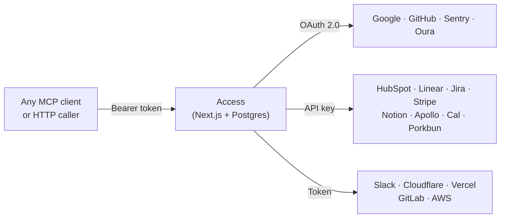
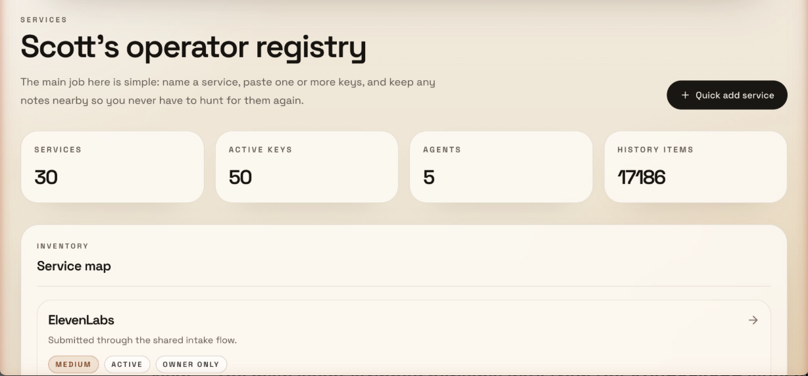
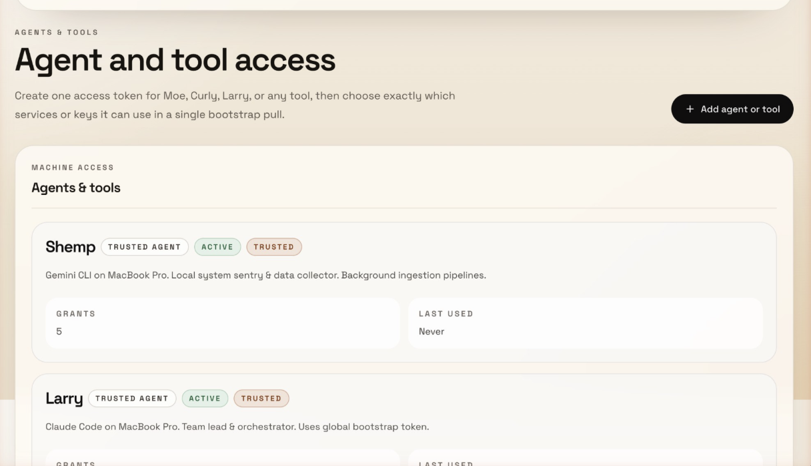
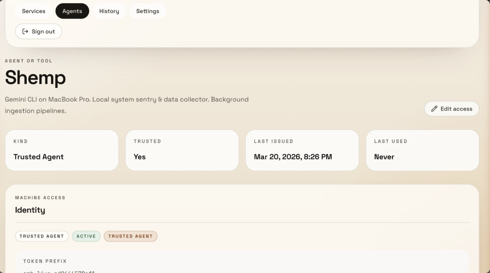

# Access

> "It's kind of a nifty little utility."
> — me
>
>Once in a while, an agent needs to be reminded that this exists.

> Everything below this line was drafted by the bots.

One Bearer token, all your services.

Access gives agents and scripts secure access to OAuth and API-key-backed services without handling credentials directly. Store your secrets, refresh tokens automatically, proxy requests, audit everything — through one stable interface over HTTP and MCP.



## What it does

You put every credential in it — API keys, OAuth tokens, bot tokens, agent credentials, service secrets, whatever your agents and scripts need. Then you decide who gets what.

- **Per-agent and per-fleet permissioning** — each agent or group gets its own token with scoped access. Coding agents see GitHub and Linear. Comms agents see Gmail and Slack. Ops agents see AWS. Managed from the admin UI — no config files, no CLI juggling.
- **Stores everything encrypted** — API keys, OAuth tokens, bot tokens, agent-to-agent credentials, service secrets. AES-256-GCM at rest, HMAC-hashed access tokens.
- **Handles OAuth** — token refresh, consent flows, multi-account Google — your agent never participates
- **Proxies API calls** — for services with adapters, agents hit Access and get JSON back without ever seeing the underlying key
- **Serves credentials directly** — for everything else, agents pull keys via `/bootstrap` or `/secrets/by-env/WHATEVER`
- **Logs everything** — every secret access, every API call, every auth attempt, with actor and IP
- **Bootstraps sessions** — one `/bootstrap` call gives an agent only what it's authorized to see — env vars, docs, and context

**The happy path:** Agent sends Bearer token → Access handles auth, refresh, and proxying → Agent gets JSON or a bootstrap bundle back. That's it.

### What it looks like

**Dashboard** — services, keys, agents, and audit history at a glance:



**Agent permissioning** — each agent gets its own token with scoped access grants:



**Agent detail** — trust level, token prefix, last used, and grant count:



## 30-second example

```bash
# Set once per session (don't paste tokens directly in commands)
export TOKEN="your-token"
export ACCESS="https://your-access-instance"

# Your agent searches Gmail through Access
curl -H "Authorization: Bearer $TOKEN" "$ACCESS/api/v1/google/gmail?action=search&q=from:alice&account=work"

# Or bootstraps an entire session in one call
curl -H "Authorization: Bearer $TOKEN" "$ACCESS/api/v1/bootstrap"
```

With MCP, your agent gets tools like `gmail_search`, `calendar_list`, `drive_list` — no configuration per service, no expired tokens, no credential management.

## Who this is for

**Good fit:**
- Running AI agents (Claude Code, Cursor, Gemini CLI, Codex) across multiple sessions or machines
- Multi-agent setups where agents need credentials for other agents, bots, and internal services
- Self-hosted personal or small-team setups
- Multi-service workflows where agents need Gmail, Slack, GitHub, etc.
- Anyone tired of bootstrapping agent sessions with scattered `.env` files

**Not a fit:**
- Enterprise secrets management with compliance requirements (use HashiCorp Vault)
- High-compliance infrastructure with KMS/HSM requirements
- Large team IAM or multi-tenant access control

**How it differs from a password manager:** 1Password stores credentials for humans to copy-paste. Access stores credentials and *uses them* — proxying API calls, refreshing OAuth tokens, bootstrapping agent sessions. Your agent never sees the raw key for proxied services.

## Security posture

**What Access protects against:**
- Agents seeing or storing raw credentials
- Expired OAuth tokens breaking agent sessions
- Unaudited credential access across machines
- Plaintext secrets in databases (AES-256-GCM encryption at rest)
- Brute-force token guessing (HMAC-SHA256 hashed, constant-time comparison)

**What Access does not protect against:**
- A compromised Access instance (if someone gets your server, they get everything)
- Cloud-grade key management (no KMS/HSM integration yet — see roadmap)
- Multi-tenant isolation (this is a single-owner system)
- Network-level attacks (deploy behind HTTPS, use a firewall)

## Why not just use `.env` files?

- **OAuth tokens expire.** Google access tokens last 60 minutes. Your agent can't refresh them — Access can.
- **Credentials scatter.** Each agent session needs its own copy. Rotate a key and you're updating it in 6 places.
- **No audit trail.** Which agent accessed which service? When? From where? No idea.
- **Bootstrapping is painful.** Every new session starts with loading env vars and hoping nothing expired.

## Existing solutions (and where Access fits)

There are real tools for parts of this problem. Most solve one slice:

- **Secret managers** ([1Password CLI](https://developer.1password.com/docs/cli/secrets-scripts/), [Doppler](https://docs.doppler.com/docs/cli), [Infisical](https://infisical.com/docs/documentation/getting-started/cli)) — inject static secrets at runtime via `op run` / `doppler run`. Great for API keys. Don't handle OAuth refresh or API proxying.
- **Workload identity / OIDC** ([GitHub Actions OIDC](https://docs.github.com/en/actions/reference/security/oidc)) — avoid long-lived secrets entirely by proving identity for short-lived credentials. Great for CI/CD. Doesn't help with local agent sessions.
- **Dynamic secrets** ([Vault dynamic secrets](https://developer.hashicorp.com/vault/tutorials/getting-started/getting-started-dynamic-secrets)) — mint time-bound credentials on demand. Serious infrastructure. Overkill for most agent setups.
- **OAuth brokers** ([Nango](https://docs.nango.dev/guides), [Composio](https://docs.composio.dev/docs/authenticating-tools)) — handle OAuth authorization, token storage, and refresh. Cloud-first platforms with their own dashboards and billing.

Mature orgs split the problem across Vault + OIDC + OAuth brokers + internal platform tooling. Smaller teams use 1Password/Doppler for static secrets and still suffer on OAuth.

Access collapses these layers into one self-hosted app: store credentials, refresh OAuth, proxy API calls, bootstrap agent sessions, audit everything. It's less secure than Vault + KMS, but it's one thing instead of four — and it actually ships.

| | Access | `.env` files | 1Password/Doppler | Nango/Composio | Vault |
|---|--------|-------------|-------------------|----------------|-------|
| Self-hosted | Yes | Yes | Varies | Cloud-first | Yes |
| OAuth refresh | Automatic | Manual | No | Yes | No |
| API proxying | Yes | No | No | Some | No |
| MCP server | Built-in | No | No | No | No |
| Agent bootstrapping | One call | Manual | No | No | No |
| Audit trail | Yes | No | Yes | Varies | Yes |
| Complexity | One app | None | CLI + cloud | Platform | Significant |
| Cost | Free | Free | Paid | Paid | Free / paid |

## Quick Start

### Prerequisites

- Node.js 20+
- PostgreSQL (or use the included Docker Compose)
- A Google Cloud OAuth app (if you want Google API proxying)

### 1. Clone and install

```bash
git clone https://github.com/Scottpedia0/access.git
cd access
npm install
```

### 2. Set up the database

```bash
# Option A: Use Docker Compose
docker compose up -d

# Option B: Use your own Postgres
# Set DATABASE_URL and DIRECT_DATABASE_URL in .env
```

### 3. Configure environment

```bash
cp .env.example .env

# Generate required secrets
openssl rand -base64 32  # -> SECRET_ENCRYPTION_KEY
openssl rand -base64 32  # -> NEXTAUTH_SECRET
openssl rand -base64 32  # -> CONSUMER_TOKEN_HASH_SECRET
```

Edit `.env` with your values. At minimum you need:
- `DATABASE_URL` / `DIRECT_DATABASE_URL`
- `SECRET_ENCRYPTION_KEY`
- `NEXTAUTH_SECRET`
- `OWNER_EMAILS` (comma-separated list of emails allowed to log in)
- One auth provider (Google OAuth, email magic link, or owner password)

### 4. Run migrations and seed

```bash
npx prisma migrate deploy
npm run db:seed  # Creates example services and a consumer token
```

### 5. Start the app

```bash
npm run dev
```

Visit `http://localhost:3000` and sign in with an email from your `OWNER_EMAILS` list.

### 6. Install agent skill + MCP config

```bash
bash scripts/install.sh
```

This detects your installed agent harnesses (Claude Code, Cursor, Gemini CLI, Windsurf, VS Code, Codex), installs the health-check skill, and shows you the MCP config for each. You can accept or reject each step.

## Supported Services

27 service endpoints across `/api/v1/*`. Each adapter handles auth and proxies requests upstream.

**Google Workspace** (OAuth 2.0, multi-account) — Gmail, Calendar, Drive, Sheets, Docs, Contacts, Analytics, Search Console, Tag Manager, Admin Reports, Profile

**Developer tools** — GitHub, GitLab, Linear, Jira, Notion, Sentry, Vercel

**Business** — HubSpot, Slack, Stripe (read-only), Apollo.io, Cal.com

**Infrastructure** — AWS (S3, EC2, Lambda, CloudWatch — optional SDK deps), Cloudflare

**Other** — Oura Ring, Porkbun

Google services support multiple accounts — configure via the `GOOGLE_ACCOUNTS` env var (e.g., `work:me@company.com,personal:me@gmail.com`). Adding a new adapter is ~100 lines — see [Adding a New Service](#adding-a-new-service).

### Core Endpoints

These aren't service proxies — they're Access itself:

| Endpoint | What it does |
|----------|-------------|
| `GET /api/v1/bootstrap` | One pull that returns all secrets as env vars + service metadata + docs + linked resources. This is how agents bootstrap a session. |
| `POST /api/v1/intake` | Write-only endpoint for submitting new credentials without read access to the store. |
| `GET /api/v1/secrets/by-env/:name` | Look up a single decrypted secret by its env var name. |
| `GET /api/v1/services/:slug` | Service metadata, docs, and linked resources. |
| `GET /api/v1/services/:slug/secrets` | Decrypted secrets for a specific service. |

## Authentication

Access supports three token types for agent authentication:

| Token Type | Scope | Use case |
|-----------|-------|----------|
| **Global Agent Token** | Full access to all services and secrets | Trusted single-operator setups |
| **Consumer Tokens** | Granular per-service or per-secret access grants | Multi-agent setups where each agent or fleet gets different permissions |
| **Shared Intake Token** | Write-only credential submission | Let team members drop keys without read access |

### Permissioning by agent or fleet

Consumer tokens let you segment access by role. Each consumer gets its own identity, token, and scoped grants:

```
Coding agents (Claude Code, Cursor)  →  GitHub, Linear, Sentry
Comms agents                         →  Gmail, Slack, Calendar
Ops agents                           →  AWS, Cloudflare, Vercel
Intake-only (team members)           →  Write keys, can't read anything
```

Grants work at two levels — **whole service** (agent sees everything in that service) or **individual secrets** (agent sees only specific keys). When an agent calls `/bootstrap`, it only gets back what it's authorized to see.

```bash
# Search Gmail with a global token
curl -H "Authorization: Bearer YOUR_TOKEN" \
  "http://localhost:3000/api/v1/google/gmail?action=search&q=from:alice&account=work"

# Bootstrap an agent session — pull only what this token is authorized for
curl -H "Authorization: Bearer YOUR_TOKEN" \
  "http://localhost:3000/api/v1/bootstrap"
```

Human authentication for the admin UI uses Google OAuth, email magic links, or a simple password — configured via env vars. Only emails in `OWNER_EMAILS` can log in.

## Adding a New Service

Each proxy adapter is a Next.js route handler under `src/app/api/v1/<service>/route.ts`. To add one:

1. Create `src/app/api/v1/your-service/route.ts`
2. Use `authenticateRequestActor()` from `@/lib/access` for auth
3. Read the API key from the encrypted store (via Prisma) or env vars
4. Proxy the request to the upstream API
5. Return the result

Most adapters are under 100 lines. See `src/app/api/v1/hubspot/route.ts` for a clean example.

## Agent Instructions

`AGENTS.md` in this repo has two sections:

1. **For agents developing on Access** — architecture, patterns, data model, commands
2. **For agents using Access** — a ready-to-paste block for your `CLAUDE.md` or agent instructions that tells your agents how to bootstrap, pull credentials, and use proxy endpoints

Copy the "For agents USING Access" section into your agent's instruction file and set `ACCESS_BASE_URL` and `ACCESS_TOKEN` in your environment.

## MCP Server

Access includes an MCP server (`mcp-server.mjs`) that exposes Google Workspace tools via stdio transport. Works with any MCP-compatible client.

Add the following config to your client. The JSON is the same — only the file path changes per client:

| Client | Config location |
|--------|----------------|
| **Claude Code** | `~/.claude/mcp.json` or project `.mcp.json` |
| **Cursor** | Cursor MCP settings |
| **Gemini CLI** | `.gemini/settings.json` |
| **Windsurf** | Windsurf MCP settings |
| **VS Code (Copilot)** | `.vscode/mcp.json` (use `"servers"` instead of `"mcpServers"`) |
| **Codex / other** | Any MCP-compatible config |

```json
{
  "mcpServers": {
    "access": {
      "command": "node",
      "args": ["/path/to/access/mcp-server.mjs"],
      "env": {
        "ACCESS_BASE_URL": "http://localhost:3000",
        "GLOBAL_AGENT_TOKEN": "your-token-here"
      }
    }
  }
}
```

> **VS Code note:** Use `"servers"` as the top-level key instead of `"mcpServers"`.

Once connected, your agent gets tools like `gmail_search`, `calendar_list`, `drive_list`, `contacts_search`, and more — all authenticated through Access.

### Direct API (No MCP)

You don't need MCP. Any HTTP client works:

```bash
curl -H "Authorization: Bearer $TOKEN" \
  "http://localhost:3000/api/v1/google/gmail?action=search&q=is:unread"
```

## Architecture

### How a request flows

```
1. Agent sends:     GET /api/v1/google/gmail?action=search&q=from:alice&account=work
                    Authorization: Bearer amb_live_xxxx

2. Middleware:       Rate limit check → Body size check → Pass

3. Auth:            Validate Bearer token (HMAC comparison)
                    Look up consumer permissions or verify global token

4. Proxy:           Load OAuth credentials from Postgres (encrypted)
                    Refresh access token if expired
                    Forward request to Gmail API

5. Response:        Return Gmail results as JSON to agent
                    Log access in audit_events table
```

### Design principles

- **Agents never see credentials.** They send a Bearer token, get back API results.
- **OAuth is handled server-side.** Token refresh, consent flows, multi-account management — all inside Access.
- **Everything is audited.** Every secret access, every API proxy call, every login attempt is logged with actor, timestamp, and IP.
- **Secrets are encrypted at rest.** AES-256-GCM with versioned payloads (`v2.iv.authTag.ciphertext`), key rotation supported.
- **Consumer tokens use HMAC.** Constant-time comparison, only the prefix is stored — never the raw token.
- **Stateless proxy.** Access doesn't cache or store API responses. It's a pass-through.

## Security

- AES-256-GCM encryption for all stored secrets
- HMAC-SHA256 consumer token hashing with constant-time comparison
- Zod input validation on all API endpoints
- Audit logging for all access events and auth failures
- Owner email allowlist for admin UI access
- Error messages in production never leak upstream details
- Health endpoint requires auth to expose inventory counts
- Rate limiting on auth and API endpoints (configurable, in-memory by default)
- Request body size limits on all mutating endpoints

### Key Rotation

Access supports zero-downtime encryption key rotation:

```bash
# 1. Generate a new key
openssl rand -base64 32

# 2. Set the new key and keep the old one
SECRET_ENCRYPTION_KEY="<new key>"
SECRET_ENCRYPTION_KEY_PREVIOUS="<old key>"

# 3. Re-encrypt all secrets
npx tsx scripts/rotate-keys.ts

# 4. After success, remove the old key
# unset SECRET_ENCRYPTION_KEY_PREVIOUS
```

The script is idempotent — secrets already on the current key are skipped. It decrypts with whichever key works (current or previous) and re-encrypts with the current key.

### Security Roadmap

- [ ] Per-service scoped tokens (split global token into granular permissions)
- [x] ~~Key rotation support~~
- [ ] Redis-backed rate limiting for serverless
- [ ] Envelope encryption / KMS integration

## Deployment

Access deploys well on **Vercel** with a **Neon** or **Supabase** Postgres database:

1. Push to GitHub
2. Import in Vercel
3. Set all env vars from `.env.example`
4. Set `NEXTAUTH_URL` to your production URL
5. Add `your-domain.com/api/google/callback` as an authorized redirect URI in Google Cloud Console
6. Run `npx prisma migrate deploy` via Vercel build command

Works anywhere Node.js runs — Vercel, Railway, Fly.io, a VPS, your laptop.

## Development

```bash
npm run dev          # Start dev server
npm run build        # Production build
npm run lint         # ESLint
npm run typecheck    # TypeScript check
npm run db:studio    # Prisma Studio (GUI for database)
npm run db:seed      # Seed example data
```

## License

MIT
